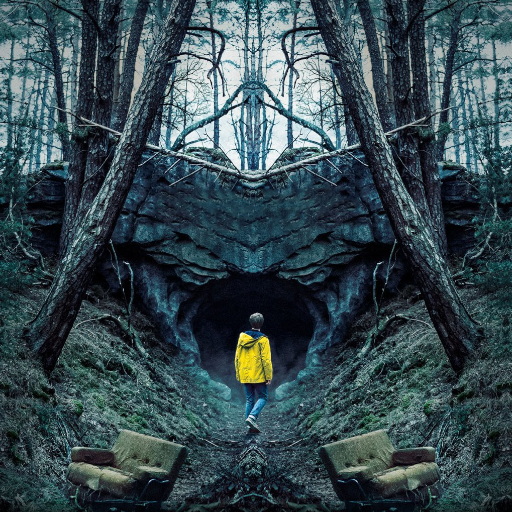
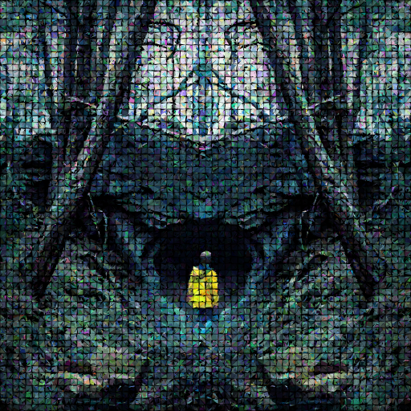
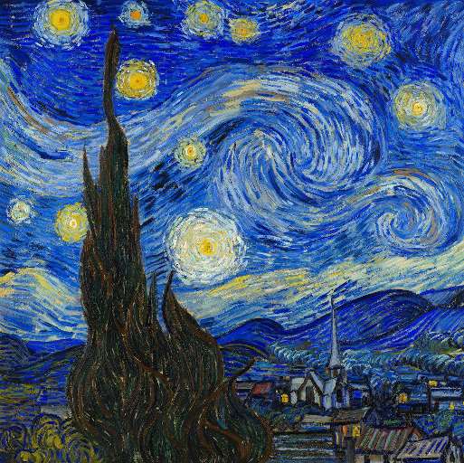
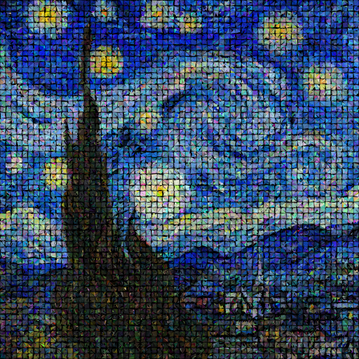

# Art generation

This application generates new image from existing one via genetic algorithm.

My algorithm uses divide and conquer strategy to decrease time of evolution and increase its quality.
Application divide initial image into small chunks (in examples bellow its 8 by 8 pixels) 
and run genetic algorithm on each chunk in parallel. 
After it, algorithm merges all chunks into final single image.


### Prerequisites

This project relies on the [Haskell Stack tool](https://docs.haskellstack.org/en/stable/README/).

It is recommended to get Stack with batteries included by
installing [Haskell Platform](https://www.haskell.org/platform/).

## Build

To build this project simply run

```sh
stack build
```

This will install all dependencies, including a proper version of GHC
(which should be there already if you have Haskell Platform 8.6.5).

## Run

This project has one executable that you can run with

```
stack exec art-generation
```

During development it is recommended a combination of `build` and `exec`:

```
stack build && stack exec art-generation
```

## Examples

Input image | Output image
:----------:|:-------------:
 | 
 | 

Other examples you can check in _outputs_ folder.

## Configuration

On top of _src/Lib.hs_ file you can find settings section to tweak behavour of application.

```
-- Size of initial image
imageSize = (512, 512)

-- Size of chunk
chunkSize = (8, 8)

-- Amount of vertices in polygon
polygonVertices = 3

-- Size of chromosome, in other words number of polygons in one chunk
chromosomeSize = 6

-- Size of population for one chunk
populationSize = 12

-- Amount of parents
parentsAmount = 2

-- Amount of genetic algorithm iterations for one chunk
gaN = 200

-- Background color of image
baseBackgroundColor = PixelRGBA8 0 0 0 255

-- Path to input image
inputImagePath = "inputs/input.png"

-- Path to output image
outputImagePath = "outputs/output.png"
```
